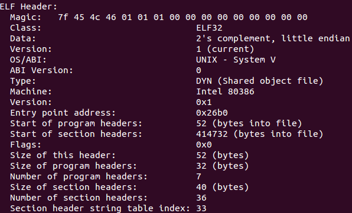

##libelf-by-example.pdf##

	$ readelf -a build/lib/libelf.so | less
	$ objdump -x

<table>
<tr><td>ELF Header</tr>
<tr><td>Section Header</tr>
<tr><td>Section Group</tr>
<tr><td>Program Header</tr>
<tr><td>Section to Segment mapping</tr>
<tr><td>Dynamic section</tr>
<tr><td>Relocation section '.rel.dyn'</tr>
<tr><td>Relocation section '.rel.plt'r</tr>
<tr><td>The decoding of unwind section</tr>
<tr><td>Symbol table '.dynsym'</tr>
<tr><td>Synbol table '.symtab'</tr>
<tr><td>Histogram for '.gnu.hash' bucket list length</tr>
<tr><td>Version symbols section '.gnu.version'</tr>
<tr><td>Version needs section '.gnu.version_r'</tr>
<tr><td>notes</tr>
</table>

#Chapter 2#

	#include <libelf.h>

	int main()
	{
		Elf* elf;
		Elf_Kind ek;
		if(elf_version(EV_CURRENT) == EV_NONE)	//首先比较版本
		{...//初始化出错}
		int fd = open(...);
		elf = eld_begin(fd, ELF_C_READ|ELF_C_WRITE|ELF_C_RDWR, NULL);	//获得elf句柄
		ek = elf_kind(elf);
		elf_end(elf);	//释放elf句柄
		return 0;
	}

###ELF Header###
	$ readelf -h

 

	typedef struct elf32_hdr{
		unsigned char	e_ident[EI_NIDENT];	//Magic~ABI Version
		Elf32_Half	e_type;	//Type(ELF文件类型)
		Elf32_Half	e_machine;
		Elf32_Word	e_version;	//ELF版本号，一般都为1
		Elf32_Addr	e_entry;	//入口地址或偏移
		Elf32_Off	e_phoff;	//Program Header的文件偏移
		Elf32_Off	e_shoff;	//Section Header的文件偏移
		Elf32_Word	e_flags;	//用来标志平台相关属性
		Elf32_Half	e_ehsize;	//ELF文件头大小
		Elf32_Half	e_phentsize;	//Program Header的项的大小
		Elf32_Half	e_phnum;	//Program Header项数
		Elf32_Half	e_shentsize;	//Section Header的项的大小
		Elf32_Half	e_shnum;	//Section Header的项数
		Elf32_Half	e_shstrndx;	//.shstrtab在Section Header中的下标
	} Elf32_Ehdr;
 

	#include <gelf.h>
	
	int main()
	{
		Elf* elf;
		GElf_Ehdr ehdr;
		size_t shdrnum;
		size_t phdrnum;
		size_t shdrstrndx;
		...	//检查版本，获得elf句柄
		gelf_getehdr(elf, &ehdr);	//填写ehdr结构体信息
		int i=gelf_getclass(elf);	//ELF32或ELF64
		char* id=gelf_getident(elf, NULL);
		elf_getshdrnum(elf, &shdrnum);	//获取section header项数
		elf_getphdrnum(elf, &phdrnum);	//获取program header项数
		elf_getshdrstrndx(elf, &shdrstrndx);	//.shstrtab节索引
		...
	}

###Program Header###
	$ readelf -l
 

	typedef struct elf32_phdr{
		Elf32_Word	p_type;
		Elf32_Off	p_offset;	//文件中偏移
		Elf32_Addr	p_vaddr;	//虚拟地址
		Elf32_Addr	p_paddr;	//LMA(Load Memory Address)，一般和虚拟地址相同(对用户态程序无意义)
		Elf32_Word	p_filesz;	//在文件中大小
		Elf32_Word	p_memsz;	//在内存中大小
		Elf32_Word	p_flags;	//权限
		Elf32_Word	p_align;	//对齐(2的指数，既是文件中也是内存中)
	} Elf32_Phdr;
 

	PT_LOAD：映射到内存
	PT_NOTE：包含辅助信息
	PT_PHDR：描述Program header本身
 

	#include <gelf.h>
	
	int main()
	{
		Elf elf;
		GElf_Phdr phdr;
		...
		elf_getphdrnum(elf, &phdrnum);
		for(int i=0;i<phdrnum;i++)
		{
			gelf_getphdr(elf, i, &phdr);
		}
		...
	}

###Section Header###
	$ readelf -S
	$ objdump -h
 

	typedef struct {
		Elf32_Word	sh_name;
		Elf32_Word	sh_type;
		Elf32_Word	sh_flags;
		Elf32_Addr	sh_addr;	//虚拟地址
		Elf32_Off	sh_offset;	//如果在文件中，则为文件中偏移，否则比如bss段为无意义
		Elf32_Word	sh_size;
		Elf32_Word	sh_link;
		Elf32_Word	sh_info;
		Elf32_Word	sh_addralign;	//2的指数
		Elf32_Word	sh_entsize;	//如符号表，则表示表项长度，无固定项长则为0
	} Elf32_Shdr;	//段表描述符（段表项）
 

	/* sh_type */
	#define SHT_NULL	0	//无效段
	#define SHT_PROGBITS	1	//程序段、代码段、数据段都是这种类型
	#define SHT_SYMTAB	2	//符号表
	#define SHT_STRTAB	3	//字符串表
	#define SHT_RELA	4	//重定位表
	#define SHT_HASH	5	//符号哈希表
	#define SHT_DYNAMIC	6	//动态链接信息
	#define SHT_NOTE	7	//提示信息
	#define SHT_NOBITS	8	//表示该段在文件中没内容
	#define SHT_REL		9	//重定位信息
	#define SHT_SHLIB	10	//保留
	#define SHT_DYNSYM	11	//动态链接符号表
	#define SHT_NUM		12
	#define SHT_LOPROC	0x70000000
	#define SHT_HIPROC	0x7fffffff
	#define SHT_LOUSER	0x80000000
	#define SHT_HIUSER	0xffffffff
 

	/* sh_flags */
	#define SHF_WRITE	0x1	//可写
	#define SHF_ALLOC	0x2	//可分配
	#define SHF_EXECINSTR	0x4	//可执行
	#define SHF_MASKPROC	0xf0000000

<table>
	<tr>
		<td/>sh_type
		<td/>sh_link
		<td/>sh_info
	</tr>
	<tr>
		<td/>SHT_DYNAMIC
		<td/>该段所使用的字符串表在段表中的下标
		<td/>0
	</tr>
	<tr>
		<td/>SHT_HASH
		<td/>该段所使用的符号表在段表中的下标
		<td/>0
	</tr>
	<tr>
		<td>
			SHT_REL SHT_RELA
		</td>
		<td/>该段所使用的相应符号表在段表中的下标	
		<td/>该重定位表所作用的段在段表中的下标
	</tr>
	<tr>
		<td/>SHT_SYMTAB SHT_DYNASYM
		<td/>操作系统相关
		<td/>操作系统相关
	</tr>
	<tr>
		<td/>other
		<td/>SHN_UNDEF
		<td/>0
	</tr>
</tabel>

		

5.1 ELF section 处理

typedef struct {
void*		d_buf;
Elf_Type	d_type;
size_t		d_size;
off_t		d_off;
size_t		d_align;
unsigned	d_version;
} Elf_Data;

#include <gelf.h>

int main()
{
Elf* elf;
Elf_Scn* scn=NULL;
Elf_Data* data;
GElf_Shdr shdr;
...
//scn=elf_getscn(elf, index);
while(scn=elf_nextscn(elf, scn)!=NULL)
{
gelf_getshdr(scn, &shdr);
scn_name=elf_strptr(elf, shstrndx, shdr.sh_name);
}
data=elf_getdata(scn, data);
...
}
Chapter 6 创建一个ELF对象
Chapter 7 处理ar
elf